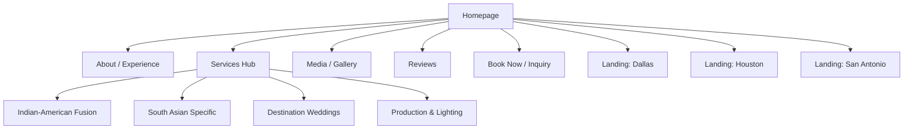

# Technical Specification: DJ LAKHA Luxury Entertainment Platform
**Author:** Principal Architect, Vercel  
**Version:** 1.0  
**Date:** 2026-02-16

## 1. Executive Summary
**Project Type:** Luxury Portfolio & Lead Generation Site  
**Target Audience:** Affluent couples planning South Asian/Fusion weddings, high-end wedding planners, and corporate event coordinators in Texas and globally.  
**Tech Considerations:**  
*   **SEO:** Critical. Must support dynamic sitemaps, semantic HTML, and fast Core Web Vitals to rank #1 against aggregators.
*   **Performance:** Image/Video heavy content requires aggressive optimization (AVIF/WebP, lazy loading) to maintain LCP < 2.5s.
*   **Responsive:** Mobile-first design is mandatory as 80% of couples browse on mobile.

---

## 2. Site Map & Hierarchy


## 3. User Flows (Primary Journeys)

### Journey A: The "Direct Booking" Couple
1.  **Entry:** Search "Indian Wedding DJ Texas" -> Lands on **Homepage**.
2.  **Action:** Sees "World Class Production" video hero -> Clicks "Media" to verify vibe.
3.  **Validation:** Watches 1 "Fusion Mix" video -> Clicks "Testimonials".
4.  **Conversion:** Clicks "Book Now" -> Fills Honeybook Embed -> Receives Auto-Responder.

### Journey B: The "Researching" Bride
1.  **Entry:** Search "Best Bollywood DJ Dallas" -> Lands on **Location Page (Dallas)**.
2.  **Content:** Reads about Dallas specific venues (Omni, Statler) -> Clicks "Services".
3.  **Discovery:** Browses "Lighting & Production" options.
4.  **Conversion:** Clicks "Inquire" to get a quote.

### Journey C: The Wedding Planner
1.  **Entry:** Direct URL / Instagram Bio.
2.  **Action:** Scans **Portfolio** for "Lighting Setup" photos.
3.  **Validation:** Checks **About** for experience/professionalism.
4.  **Conversion:** Uses direct email/contact form for partnership.

---

## 4. Component Inventory (System Design)
**Design System: "Luxe Gold"**

### Atoms (Primitives)
1.  `Typography`: Headings (Serif/Cormorant), Body (Sans/Inter).
2.  `ColorPalette`: Gold (#C5A059), Charcoal (#141414), Black (#000000).
3.  `ButtonPrimary`: Gold gradient, pill shape, hover lift.
4.  `ButtonSecondary`: Transparent, gold border.
5.  `Icon`: Lucide React set (thin stroke).
6.  `Divider`: Gold line with fade-out edges.

### Molecules (UI Elements)
7.  `NavBar`: Sticky, blurred background, logo left, links right.
8.  `MobileMenu`: Full-screen overlay, animated entry.
9.  `HeroVideo`: Background video component with fallback image.
10. `SectionHeader`: Centered H2 with subtitle and distinct visual separator.
11. `ServiceCard`: Vertical layout, icon/image top, hover reveal effect.
12. `ReviewCard`: Star rating, text, client name, venue/date.
13. `MediaGridItem`: Square aspect ratio, lightbox trigger on click.
14. `SoundCloudEmbed`: Custom wrapper for player.
15. `ContactForm`: Wrapper for Honeybook iframe.

### Organisms (Sections)
16. `HeroSection`: Full viewport height, text overlay, CTA.
17. `ServicesGrid`: Responsive grid (1col mobile, 3col desktop).
18. `LogoTicker`: "As Seen In" or "Venues We Love" infinite scroll.
19. `StatsRow`: 3-column stats (Events, Years, locations).
20. `CallToAction`: Dark background, large text, primary button.
21. `Footer`: Links, Socials, SEO Service Area text.

---

## 5. Technical Stack Recommendation
**Framework:** **Next.js 14+ (App Router)**  
*Why:* Server-Side Rendering (SSR) is non-negotiable for the "Rank #1" SEO goal. Next/Image component automatically optimizes the heavy portfolio images.

**Hosting:** **Vercel**  
*Why:* Global Edge Network for fast asset delivery to "Destination Wedding" clients abroad. Zero-config deployments.

**Styling:** **Tailwind CSS**  
*Why:* Rapid development, small bundle size, consistent design tokens.

**Content:** **MDX or Headless CMS (Sanity.io)**  
*Why:* Allows DJ Lakha to easily add "Venue Guides" or "Blog Posts" without coding, which is crucial for the content strategy.

**Motion:** **Framer Motion**  
*Why:* High-end "Luxury" feel requires smooth entry animations (`fade-in-up`) that standard CSS struggles to coordinate perfectly.

---

## 6. Performance Budgets
*   **LCP (Largest Contentful Paint):** < 2.5s (Target: < 1.2s on WiFi).
*   **CLS (Cumulative Layout Shift):** 0 (Essential for luxury feel - no jumping content).
*   **INP (Interaction to Next Paint):** < 200ms.
*   **Image Strategy:** All images > 100kb converted to WebP/AVIF. Hero video limited to 720p/2MB loop.

---

## 7. SEO Structure & URL Patterns
**Meta Data Strategy:**
*   `title`: `[Service] in [City] | [Brand Name]`
*   `description`: 155 chars, geo-targeted keywords.
*   `og:image`: Dynamic generation based on page content.

**URL Structure:**
*   `/` (Home - General Texas focus)
*   `/services/fusion-weddings` (Specific Offerings)
*   `/locations/dallas-indian-wedding-dj` (Local SEO Landing Page)
*   `/locations/houston-indian-wedding-dj` (Local SEO Landing Page)
*   `/gallery` (Media)
*   `/reviews` (Testimonials)

---

## 8. Data Models (TypeScript Interfaces)

```typescript
type Service = {
  id: string;
  title: string;
  shortDescription: string;
  fullDescription: MDX;
  icon: string;
  slug: string;
};

type Review = {
  id: string;
  clientName: string;
  rating: 5; // We only show 5 stars
  text: string;
  weddingDate: Date;
  venue?: string;
  city?: string; // For SEO linking
};

type VenueGuide = {
  name: string;
  city: "Austin" | "Dallas" | "Houston";
  description: string;
  capacity: number;
  imageUrl: string;
  slug: string;
};
```
